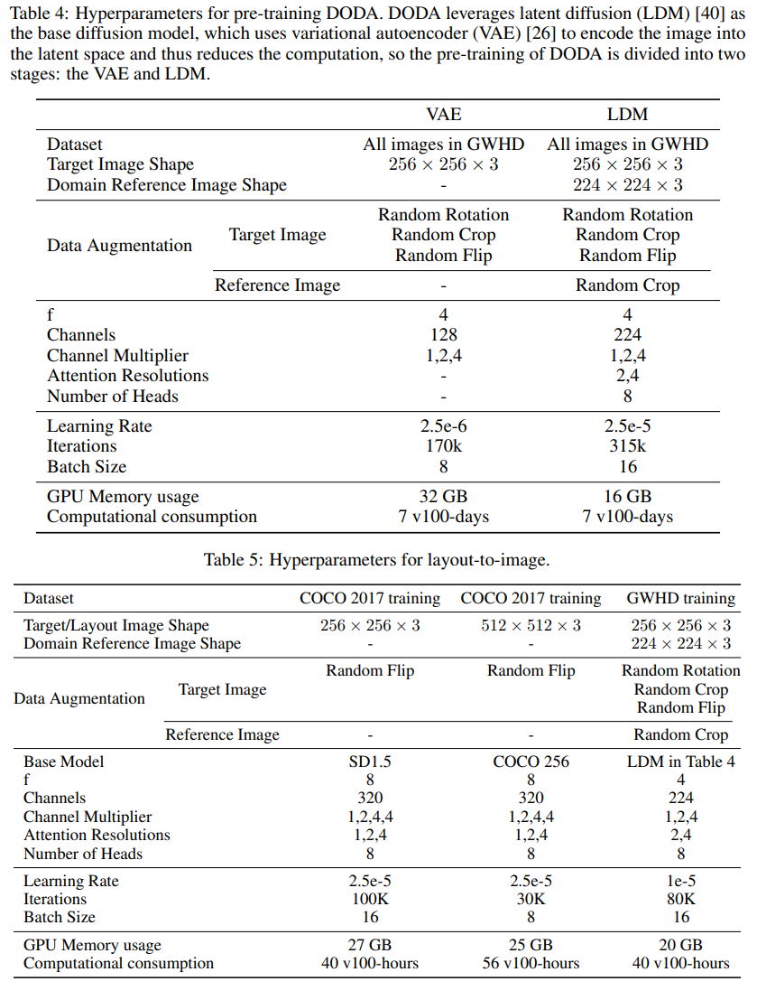

# DODA
Official implementation of [Diffusion for Object-detection Domain Adaptation in Agriculture](http://arxiv.org/abs/2403.18334)

DODA is a data synthesizer that can generate high-quality object detection data for new domains in agriculture, and help the detectors adapt to the new domains.


## Pretrained Models
| Model | Dataset | Resolution | Training Iters | Downlad Link |
|:-:|:-:|:-:|:-:|:-:|
|DODA-L2I|COCO|512x512|30K|[Google drive](https://drive.google.com/file/d/1Xm2gOA5QdtYyGQe6Lik-wXlyJTxFTc-F/view?usp=sharing)|
|DODA-L2I|COCO|256x256|100K|[Google drive](https://drive.google.com/file/d/1l4bJfBRqa0gyLgqpj6Fw1jHsXenEIz15/view?usp=sharing)|
|VAE|GWHD2021|256x256|170K|[Google drive](https://drive.google.com/file/d/1XHmtZR95uSbFcY-y6wCffgV5uUM1x8pC/view?usp=sharing)|
|DODA|GWHD2021|256x256|80K|[Google drive](https://drive.google.com/file/d/1fR4yOhLDwTvyaP2l-TKi0iEApnXy60Lh/view?usp=sharing)|
|DODA-ldm|GWHD2021|256x256|315K|[Google drive](https://drive.google.com/file/d/1pHsJBmC5D33W8zmZoJfrjcayIzatlpn4/view?usp=sharing)|


## Evaluation

### Setup Environment
```
conda create -y -n DODA python=3.8.5
conda activate DODA
pip install torch==1.13.0+cu116 torchvision==0.14.0+cu116 --extra-index-url https://download.pytorch.org/whl/cu116
pip install -r requirements.txt
```

### Download Datesets
```
bash Download_dataset.sh
```

### Prepare Datesets
```
python prepare_coco.py
python prepare_wheat_trainset.py   # If you only want to test the model`s performance on GWHD, there is no need to run this line
python prepare_Terraref_testset.py
```

### Generate Images for Evaluation
Generate images according to the bounding boxes of the COCO 2017 validation set:
First download the pretrained DODA-L2I to `/models` folder, then run:
```
python generate_coco_testimg.py
```
Generate images according to the bounding boxes and reference images of the Terraref domain:
First download the pretrained DODA to `/models` folder, then run:
```
python prepare_Terraref_testset.py
```

If you want to generate data to train the detector, first generate layout images using `random_generate_layout_images.py`, then use `generate_data_for_target_domain.py` to generate the data.
If you want to generate data for your own domain, please refer to `generate_data_for_target_domain.py`

## Generate images in GUI
You can try our method to generate images for wheat through the GUI: 
```
python wheat_gradio_box2image.py
```

Please upload <u>**BOTH**</u> the <u>**reference image**</u> and <u>**layout image**</u> image respectively as shown:


> PS: The demo <u>**reference image**</u> and <u>**layout image**</u> can be found in the `/figures` folder. More images can be found in `/dataset` folder after run `prepare_wheat_trainset.py`

Or you can simply draw it yourself through drawing software. Each item should have a distinguishable color (with maximized values of the R, G, B channels), for example, `(0, 0, 255)`, `(255, 0, 255)`, etc. Below are some examples of possible layout images:


## Train your own DODA
DODA training is divided into three parts, from first to last: VAE, LDM and controlnet. This repository reads the data set through a txt file, so first, please write the file names of all the images in your own dataset into a txt file.
### Training of VAE
Modify the `config` in `train_wheat.py` :
```
config = 'configs/autoencoder/DODA_wheat_autoencoder_kl_64x64x3.yaml'
```
Modify the `txt_file` and `data_root` in the config file to the path of the filenames txt file and the path to your own dataset.

then train the VAE by running:
```
python train_wheat.py
```
VAE is very robust, so we recommend skipping VAE training and using the pre-trained weight `kl-f4-wheat.ckpt` we provide.

### Training of ldm
Modify the `config` in `train_wheat.py` :
```
config = 'configs/latent-diffusion/DODA_wheat_ldm_kl_4.yaml'
```
Modify the `ckpt_path` in the config file `DODA_wheat_ldm_kl_4.yaml` to the weight path of your VAE or the VAE provided by us.

Modify the `txt_file` and `data_root` in the config file to the path of the filenames txt file and the path to your own dataset.

then train the ldm by running:
```
python train_wheat.py
```

### Training of cldm
Modify the `input_path` in `tool_add_control.py` to the weight path of your ldm or the ldm provided by us, and modify `output_path` to specify the name of the output weight.
Run `tool_add_control.py` to add the ControlNet to the ldm:
```
python tool_add_wheat_control.py
```
Modify the `resume_path` in `train_wheat.py` to the path of the output weight.

Modify the `config` in `train_wheat.py` :
```
config = 'configs/controlnet/DODA_wheat_cldm_kl_4.yaml'
```
Modify the `txt_file` and `data_root` in the config file to the path of the filenames txt file and the path to your own dataset.

then train the cldm by running:
```
python train_wheat.py
```

### Hyperparameters for training


### Training tips
Diffusion model is data hungry, and using more data always gives better results, so we strongly recommend mixing your data with GWHD for training. Mixing data can be achieved by putting all the images in your own dataset and the GWHD into one folder and writing the filenames of all images to one txt file.
